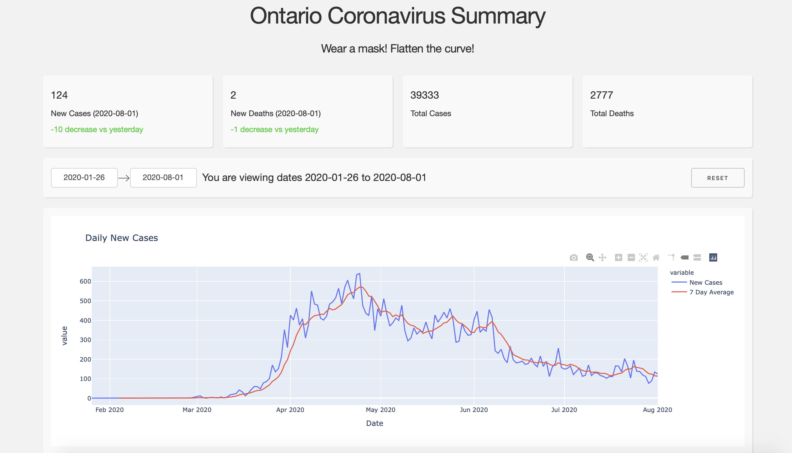

# COVID-19 Twitter Bot & Dashboard  

This repository contains source code for the COVID-19 Twitter bot and Dashboard.

This project was created to make coronavirus data (within Ontario) more accessible, interactive and meaningful to the general public.

## Dashboard
Dashboard utilizes the Plotly Dash library to create and present visualizations. Data is pulled from a Postgresql database that is updated daily.

The initial layout, including the graph generation, is handled with serverside Python. Using the Plotly-Dash library, I was able to generate a simple HTML structure for the site. Creating the initial layout on the serverside ensures the app loads as fast as possible for end users. All stying touches for the app components (graphs, graph surrounds, titles, etc) are handled using CSS.

Interactive components of the app, such as the date range selector, are handled with JavaScript clientside callbacks. In contrast to Plotly-Dash's traditional method of serverside callbacks, clientside callbacks are significantly faster since they do not need to send requests to the server.

Check it out here: [ontariocovid-19.com](http://www.ontariocovid-19.com)

## Twitter Bot

The bot queries data from the Government of Ontario's coronavirus API, formats the data, and sends a tweet via the Twitter API.

Daily updates occur at approximately 10:30AM EDT (UTC -4).

Follow @OntarioCovid19

## Built With
Python, Flask, Dash, Tweepy, Peewee, Postgresql, Heroku, Government of Ontario API, Twitter API

## Data Sources
[https://data.ontario.ca/organization/cabinet-office](https://data.ontario.ca/organization/cabinet-office)
